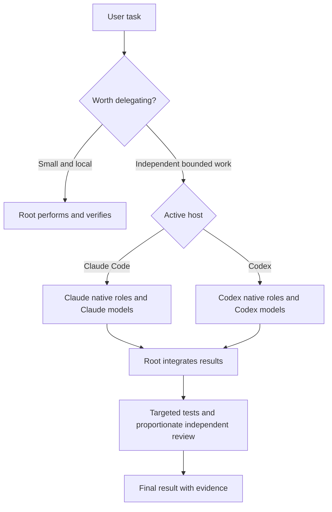

# Native model orchestration for Claude Code and Codex

Research date: 2026-09-26. Recent-evidence window: 2026-08-27 through 2026-09-26.

Implementation follow-up: the user subsequently requested creation of the skill. See [skill validation](skill-validation.md) for that work; the research-stage statements below describe the state before implementation.

## Decision

Build one portable `orchestrate` skill with a shared workflow and separate native configuration for each host. Claude Code must use Claude Code subagents and Claude models only. Codex must use Codex subagents and models available in Codex only. No CLI bridge, provider proxy, cross-product agent, or third-party orchestration service belongs in this design.

This reflects the user's clarification during research. “No delegation” was stated in the context of keeping each product within its own ecosystem; the proposed model routing uses native subagents within the active product.

The skill should decide whether to delegate, define bounded assignments, choose a suitable role and model tier, supervise completion, and verify the integrated result. Host configuration actually exposes the roles and selects their models. A Markdown instruction to “use the cheap model” is not sufficient evidence that the runtime used it.

This is a research and design deliverable, not an installed or benchmarked skill. Existing user configuration has not been changed.

The [preferred-source ledger](preferred-sources.md) records all 13 preferred repositories plus the user-supplied reference, with concrete influences and exclusions.

## Evidence and limits

- Ran the installed last30days 3.21.1 engine with a three-query plan, `--deep`, `--days=30`, `--as-of=2026-09-26`, resolved communities and three GitHub repositories. See [query-plan.json](query-plan.json) and [raw research](claude-code-codex-model-routing-orchestration-raw.md).
- The engine returned 55 items: 27 Reddit threads, 25 Hacker News stories, and three GitHub results. Reddit coverage was partial after HTTP 429 responses. X, YouTube, TikTok and Instagram were not configured. No cookie access or new credentials were requested.
- The engine normalized the how-to plan to `evergreen_ok` despite the supplied `strict_recent` preference. Its displayed window remains 30 days, but individual dates must be checked before describing an item as recent. Current documentation and repository snapshots are structural evidence, not evidence that a feature launched this month.
- The broad scan surfaced substantial product-comparison noise. It does not establish that a particular routing policy is best, or that multi-agent work saves money. Technical conclusions below rely on primary documentation and repository code; discussion is a source of hypotheses and failure cases.
- One query included cross-product orchestration before the user's clarification. Those results are excluded from the proposed implementation.
- Local versions observed: Claude Code `2.1.283`; Codex CLI `0.156.1`. Documentation may advance independently of these binaries. No paid model benchmark was run.

## Proposed architecture

### Verified native mechanisms

**Claude Code:** custom agents live in `.claude/agents/` or `~/.claude/agents/`. Their frontmatter supports explicit `model`, `effort`, tools, `maxTurns` and isolation controls. Model precedence is invocation, agent definition, `CLAUDE_CODE_SUBAGENT_MODEL`, then main model. `CLAUDE_CODE_SUBAGENT_MODEL_FORCE=1` can override this differentiated routing; inspect it before trusting the profile. Explore inherits the main model as of 2.1.198, with an Opus cap on the Claude API, so do not assume it uses Haiku. These are current documented behaviors, not a smoke-tested installation. [Subagent documentation](https://code.claude.com/docs/en/sub-agents).

Claude's aliases and model availability depend on the provider/account. Prefer explicit role aliases with a recorded resolved model when observable; Opus/Sonnet/Haiku are proposed routing choices, not an exhaustive current catalog. [Model configuration](https://code.claude.com/docs/en/model-config).

Keep the orchestration skill in the main conversation: making the controller itself a `context: fork` skill would move it into a worker context. Use agent `skills:` to provide selected supporting knowledge; skill installation and agent installation are distinct. [Skills documentation](https://code.claude.com/docs/en/skills).

Claude teams provide independent sessions and peer messaging but remain experimental and require a feature switch. Scripted workflows offer deterministic composition and larger fan-out. Neither is necessary for this first version. Use ordinary subagents for bounded work; consider teams only for peer collaboration and workflows only for repeated, well-defined pipelines. [Agent teams](https://code.claude.com/docs/en/agent-teams), [workflows](https://code.claude.com/docs/en/workflows).

**Codex:** native custom agents use TOML in `.codex/agents/` or `~/.codex/agents/`, with `name`, `description`, `developer_instructions`, and optional `model`, `model_reasoning_effort` and sandbox configuration. Role configuration, spawn parameters, defaults and inheritance interact; set model and effort together and inspect the active host's tool schema. This desktop session fixes model/effort for specialized role types, so a generic promise that every call can override a role would be incorrect. [Subagent documentation](https://learn.chatgpt.com/docs/agent-configuration/subagents).

The current configuration reference documents `[agents]` defaults and concurrency controls. The local CLI reports stable `multi_agent` enabled and `multi_agent_v2` disabled; this is local evidence, not a requirement to enable V2. Never transplant an API multi-agent example into Codex CLI configuration. [Configuration reference](https://learn.chatgpt.com/docs/config-file/config-reference).

Current public model docs and the linked repository use GPT-6 variants, while this project's existing role files use GPT-5.6 Luna. Both facts can be true. Preserve the project profile and validate the target catalog rather than updating IDs opportunistically. [Codex models](https://learn.chatgpt.com/docs/models).

Keep three concerns separate:

1. **Workflow policy:** when work benefits from agents, dependency order, contracts, ownership, escalation and completion checks.
2. **Host configuration:** Claude agent Markdown/frontmatter or Codex role TOML, including actual models and supported effort settings.
3. **Evidence:** task status, dispatch identity, requested model, observed model when exposed, edits, checks, failures and usage.

Use a shallow coordinator-and-workers topology by default. The root owns architecture, dependency decisions, integration and final acceptance. Workers do not recursively create an unbounded team. Use two concurrent workers as a starting policy, expanding to four only for independently verifiable tasks with separate ownership. These numbers are proposed defaults to evaluate, not vendor limits.



### Routing should depend on difficulty and verifiability

Role names alone are too coarse. A small file lookup and a cross-service race-condition investigation are both exploration, but need different capability. Begin with the least expensive configured model likely to meet the acceptance criteria, considering ambiguity, scope, failure impact and how cheaply the result can be checked.

| Work | Proposed Claude policy | Proposed Codex policy | Verification |
| --- | --- | --- | --- |
| Small one-file change | Keep with current root | Keep with current root | Focused diff/check |
| File discovery, extraction, narrow mapping | Explicit Haiku role if available | Configured Luna explorer | File/symbol evidence |
| Bounded implementation | Sonnet worker | Luna worker initially; stronger configured worker for harder slices | Behavior checks and diff |
| Mechanical tests and reproduction | Haiku for straightforward execution; Sonnet for analysis | Luna tester | Exact command, exit status, assertions |
| Research and difficult diagnosis | Sonnet; Opus when ambiguity warrants | Luna researcher; root-controlled escalation | Primary sources or reproduction |
| Architecture and integration | Existing root, preferably Opus for complex work | Existing Astra/Sol root according to profile | Root decision and integration checks |
| Material security/concurrency review | Independent Opus reviewer | Independent Astra reviewer | Concrete findings with evidence |

This is a hypothesis for evaluation, not a claim that model families are interchangeable or universally ranked. Retain a user's selected root model. A skill should never silently upgrade it, weaken permissions, or substitute another provider.

The currently installed project profile is Astra `medium`, GPT-5.6 Luna `max` for routine roles, and Astra `low` for review. Preserve it as an explicit existing profile. Test lower effort separately rather than changing the user's settings as a side effect of research.

### Assignment contract

Every task should contain:

```text
Task ID and objective:
Inputs and evidence already gathered:
Files owned; files that must not change:
Dependencies that must be satisfied before starting:
Expected result and acceptance criteria:
Role, requested model, requested effort if supported:
Allowed tools/permissions inherited from the host:
Retry/time limit and conditions for returning to the root:
```

The result should contain a status (`completed`, `blocked`, `failed`, or `cancelled`), relevant files and symbols, change summary, commands with observed results, remaining uncertainty and any decision the root must make. Record actual model identity only if the host exposes it. “Requested” must not be relabelled “observed.” Never infer a successful spawn from prose saying it happened.

### Coordination and recovery

- Dispatch independent work together; serialize tasks with dependencies. Do not create a tester before its implementation input exists merely to fill a slot.
- Use one active writer per file or subsystem. Disjoint changes may share a checkout; use separate worktrees when ownership cannot reliably prevent overlap. The root integrates and resolves conflicts.
- Distinguish a timeout from confirmed termination. Before replacing a writer, stop or establish the state of the original worker, inspect its partial diff, and explicitly transfer ownership.
- Retry once with a narrower contract for a recoverable failure. If the problem is capability rather than missing information, escalate one configured tier with a recorded reason. After another failure, the root reassesses the plan instead of looping indefinitely.
- Completion requires actual artifacts and checks. A worker's confidence or “done” message is not acceptance. The root reruns the smallest checks needed after integration and decides whether independent review is warranted.
- Reviews should receive the specification, relevant diff and test evidence, with room to form an independent judgment. Do not require approval from every role on every trivial task.
- Keep a compact progress record only for work that warrants it. Small tasks should not pay for a task database, elaborate ceremony or repeated status polling.

## Integration with this repository

The checkout already contains an untracked `.agents/skills/astra-orchestrator/SKILL.md`, `.codex/config.toml`, five `.codex/agents/*.toml` roles, and `.changeset/orchestrate-native-agents.md`. The changeset describes a portable orchestration skill, but the published `skills/` tree and plugin manifest do not yet include one. These are existing user changes and were left untouched.

Recommend a new public entry point `skills/engineering/orchestrate/SKILL.md`. Keep `astra-orchestrator` as the existing local profile until migration is deliberately performed. Avoid two overlapping automatic orchestration instructions that disagree on when delegation is mandatory.

Proposed package layout:

```text
skills/engineering/orchestrate/
  SKILL.md
  references/
    claude-code.md
    codex.md
    routing.md
    task-contract.md
    recovery.md
  assets/
    claude-agents/
    codex-agents/
    profiles/
  evals/
    cases.json
    rubric.md
```

Keep the entry point short and load only the active host's reference. Templates should live with the skill; any plugin-discovered agent entries should be generated or checked from that single source. Installing or linking a skill is distinct from installing native agent definitions. `scripts/link-skills.sh` links skills, not host role configuration, and is explicitly a development helper rather than a supported installer.

Compose existing skills instead of duplicating them: planning-and-task-breakdown for slices, implement for execution, diagnosing-bugs for diagnosis, code-review for review, verification-before-completion for acceptance, git-workflow for checkout management, and handoff for interrupted sessions. The orchestrator owns sequencing and resource allocation.

Before publishing, add the top-level README entry, engineering bucket README entry, plugin manifest skill entry and `docs/engineering/orchestrate.md`. Keep manifest/package versions synchronized and run `claude plugin validate . --strict` after a manifest change, followed by the repository checks. Research alone needs no manifest or version change.

## Evaluation plan

Compare three conditions on identical starting commits and prompts: current root-only baseline, the current installed orchestration profile, and the proposed adaptive policy. Run at least three repetitions per task and host. Separate cold and warm cache results and isolate other account activity when recording quota changes.

Use a representative task set:

1. Trivial typo or localized fix: should stay root-only.
2. Two independent modules: parallel work with explicit ownership.
3. Implementation followed by a dependent test update: correct sequence.
4. Cross-component defect: gather evidence before changing code.
5. Security or concurrency change: stronger independent review.
6. Unsupported model or effort: explicit failure or configured fallback.
7. Interrupted writer: no replacement writes until ownership is reconciled.
8. Failing tests and misleading worker success: root rejects completion.
9. Mixed-host prompt: stays entirely in the active ecosystem.
10. Resume after context loss: recover task state and preserve user edits.

Measure accepted task success, regressions, route compliance, retries, root intervention, elapsed time, input/cached-input/output/reasoning tokens where available, and account usage deltas. Avoid treating raw token totals as a price estimate or quota percentages as attributable when other sessions were active.

Hard acceptance gates: no cross-host calls, no concurrent ownership violations, no false completion, no unavailable model silently substituted, and no unauthorized permission changes. Optimize time and usage only among runs that pass correctness gates. Neither parsing configuration nor passing unit tests proves that real dispatch used the desired model; add live smoke runs for each role during implementation validation.

## Implementation sequence

1. Write the portable policy and the two host references; make native-only behavior explicit.
2. Add minimal named roles with explicit models, conservative tools and no recursive orchestration by default.
3. Add configuration validation and a dry-run routing explanation before any installer.
4. Exercise the failure/recovery and model-identity checks above.
5. Benchmark real work, tune routing, and publish only the behavior demonstrated by those results.

Prefer a small instruction/configuration package first. Add hooks or a scheduler only when evaluation proves that prompt and native configuration cannot reliably enforce a necessary constraint.

## Research validation

The last30days engine completed successfully with the partial coverage described above. Repository skill inventory was collected using `scripts/list-skills.sh`; the published `skills/` tree was checked separately because the helper also listed local worktree copies. CLI versions and existing project configuration were read, and current official documentation and preferred repositories were inspected. Configuration examples and the proposed routing matrix have not been executed as a new skill. No runtime savings or success-rate improvement is claimed.

Pre-existing modifications to `AGENTS.md`, `.agents/skills/`, `.codex/`, and the orchestration changeset were preserved. The only task deliverables are in this research directory. No installation, linking, publication, commit, or manifest change was performed.
