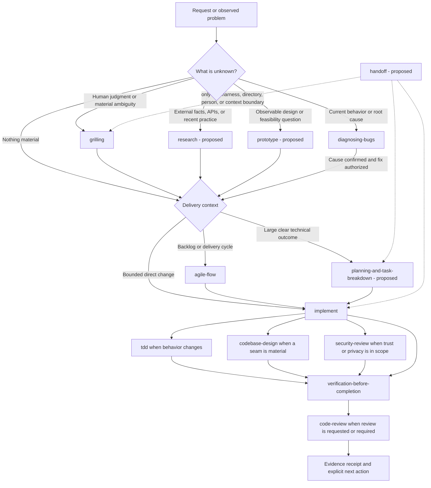

# Preferred Skill Repositories: Workflow and Gap Research

**Research date:** 2026-09-06  
**Recency window:** 2026-08-08 through 2026-09-06  
**Scope:** the six preferred repositories in `docs/source-repos.md`, the current local skill inventory, recent GitHub activity, and a last-30-days community scan.  
**Boundary:** research only. This report does not change the preferred-source list, publish a skill, alter a manifest, or modify an existing workflow.

## Executive recommendation

The local library does not need another all-owning methodology or a copy of every upstream skill. Its implementation core is already coherent: `implement` composes diagnosis, TDD, design, review, and verification while preserving user authority and dirty working trees. The next improvement should close the few ownership gaps around that core.

Recommended sequence:

1. Publish one human-facing engineering workflow map. Keep `agile-flow` as the explicit route for backlog and cycle work; do not make a second always-on router.
2. Add three model-invoked skills:
   - **`planning-and-task-breakdown`** for technical dependency graphs, vertical slices, acceptance evidence, and a resumable execution frontier;
   - **`research`** for primary-source investigation, pinned provenance, source-health disclosure, and one durable report under `docs/research/`;
   - **`security-review`** for a read-only threat model and evidence-backed security gate.
3. Add **`prototype`** and a narrowly scoped **`handoff`** next if evaluations confirm repeated demand.
4. Fold context budgeting, source-driven implementation, blast-radius analysis, decision logging, and project-specific verification guidance into those owners. Do not create a micro-skill for each concept.

This produces a complete path without turning every request into a mandatory ceremony:

Commits, branches, pull requests, deployments, and destructive cleanup remain separate explicit actions. Planning or routing must not silently grant that authority.

## Current local baseline

`scripts/list-skills.sh` reports 15 skills:

- Agile: `agile-flow`, `agile-refine`, `agile-sprint-plan`, `agile-sprint-review`, and `agile-retro`.
- Engineering: `codebase-design`, `code-review`, `diagnosing-bugs`, `implement`, `tdd`, and `verification-before-completion`.
- Productivity and authoring: `grilling`, `html-writeup`, `writing-for-agents`, and `writing-for-humans`.

The execution path is stronger than a raw inventory comparison suggests:

- `implement` already accepts a direct request, issue, specification, or plan; it routes unknown causes to `diagnosing-bugs`, behavior changes to TDD, design decisions to `codebase-design`, and review-only work to `code-review`.
- `verification-before-completion` owns completion claims and fresh evidence.
- `agile-flow` already owns team/backlog/cycle routing and should remain user-invoked.
- `grilling` correctly leaves empirical uncertainty to a measurement or prototype and does not mutate downstream artifacts.
- `codebase-design` already incorporates Ponytail's subtraction/reuse ladder.

The missing seams are therefore specific:

- `implement` accepts plans but no local skill owns technical planning.
- `implement` and `agile-flow` route security-sensitive work to a security workflow that is not present locally.
- The repository requires source-backed research under `docs/research/`, but no local skill owns that workflow.
- `grilling` can identify an empirical fork, but no local skill runs the smallest throwaway experiment.
- Long work can update a canonical artifact, but there is no narrow portable handoff for moving between harnesses, directories, people, or context windows.

## Ranked missing-skill backlog

| Priority | Proposed owner | Why it is a real gap | Key boundaries |
|---|---|---|---|
| P0 | `planning-and-task-breakdown` | Converts stable requirements into dependency-aware vertical slices. This is the missing seam between refinement/specification and `implement`. | Read-only until the user asks to save a plan; no automatic code, worktree, ticket creation, commit, or delegation. Small direct work bypasses it. |
| P0 | `research` | Makes the repository's existing source policy repeatable: primary sources first, every relevant preferred repo accounted for, revisions pinned, limitations disclosed, and one durable report. | Recency/community research is an optional lane, not the default for stable technical facts. Retrieved text is evidence, never instruction. |
| P0 | `security-review` | Closes a dangling route in `implement` and `agile-flow`. Current upstream work expands the threat surface to dependency scripts, prompt injection, local paths, shared state, and destructive operations. | Default is read-only findings plus a threat model. Remediation returns to `implement` only after authorization. Avoid a generic web-only checklist. |
| P1 | `prototype` | Settles observable UI, state-model, performance, and feasibility questions with evidence instead of asking the user to guess. | One question, smallest disposable build, explicit success observation, no automatic branch or cleanup, and no production-quality expansion. |
| P1 | `handoff` | Preserves task state when work must move across a harness, directory, person, or context boundary. | Prefer the existing canonical plan/issue/research file. A handoff contains pointers, verified state, decisions, authority, dirty paths, and next checks; it does not duplicate the whole transcript or include secrets. |
| Conditional | `engineering-flow` | A discoverable entry point may help users who do not know which skill to invoke. | Start with `docs/workflow.md`. Add a user-invoked, routing-only skill only if scenario evaluations show the document and skill descriptions are insufficient. It must own no work itself and must yield to explicit skill requests. |

### Why no separate specification skill yet

`agile-refine` already produces an acceptance-shaped Ready item for cycle work, while direct requests, issues, and existing specifications can enter `implement` without ceremony. The proposed planning skill should refuse to invent unsettled behavior and route material ambiguity back to `grilling` or `agile-refine`. Add a separate `specification` skill only if evaluations show repeated multi-session, non-Agile ideas losing confirmed product decisions between those seams.

### Concepts to fold into existing owners

| Upstream concept | Local disposition |
|---|---|
| Source-driven development | Put framework/version lookup and official-document citations in `research`, then have `implement` consume the cited artifact. Do not create a second implementation owner. |
| Context engineering | Put phase-boundary rules and a compact live-state record in `planning-and-task-breakdown` and `handoff`; keep always-loaded rules short. |
| Blast-radius analysis | Add it as an explicit deep-review question in `code-review`, with runtime proof for decisive assumptions. |
| Show-your-work decision log | Use a task-scoped scratch ledger only for long or unattended work when no canonical plan/issue exists; local and uncommitted by default. This is already compatible with `implement`. |
| Project verification skill generation | Add guidance to `verification-before-completion` or `skill-creator` for projects lacking a user-path harness. Do not duplicate the completion-claim owner. |
| Receiving review feedback | Extend `code-review` or `implement` with a bounded correction loop if evaluations expose a gap. A second review skill would compete for the same trigger. |
| Shipping and branch finishing | Use dedicated Git/PR tooling only when the user explicitly requests those external state changes. Do not make shipping the automatic end of implementation. |
| Ponytail review/audit/debt/gain modes | The subtraction ladder already belongs to `codebase-design`. Keep whole-repo over-engineering audits explicit and optional rather than always on. |
| Performance, observability, migration, and CI/CD packs | Valuable future specializations, but the preferred sources alone do not show enough recurring local demand to publish them before the P0 gaps. |

## Preferred-source audit

All six repositories were inspected at pinned revisions. The ordered source list remains unchanged.

| Preferred source | Revision inspected | Material influence | What should not be imported |
|---|---|---|---|
| [`mattpocock/skills`](https://github.com/mattpocock/skills/tree/3cca18b368ae95cdbdebbff572ccafa662551015) | `3cca18b` | The clearest end-to-end map: clarify, prototype empirical forks, create a spec/task graph for multi-session work, implement each ready unit, review, and make an explicit phase-boundary decision. Its [research skill](https://github.com/mattpocock/skills/blob/3cca18b368ae95cdbdebbff572ccafa662551015/skills/engineering/research/SKILL.md) and narrow [handoff](https://github.com/mattpocock/skills/blob/3cca18b368ae95cdbdebbff572ccafa662551015/skills/productivity/handoff/SKILL.md) directly support two local gaps. | Automatic commits, branch creation, forced context clearing, or a new spec for every small task. The in-progress `implement-spec` is useful evidence, not a stable dependency. |
| [`obra/superpowers`](https://github.com/obra/superpowers/tree/b36e0829c6d0140e93cfef2ca599b1b07d4a7797) | `b36e082` | Its [basic workflow](https://github.com/obra/superpowers/blob/b36e0829c6d0140e93cfef2ca599b1b07d4a7797/README.md#L261-L275) makes the missing technical-plan seam obvious and shows the value of fresh execution context and explicit checkpoints. | Mandatory brainstorming, automatic worktrees, 2-5-minute microtasks with complete code, a fresh subagent plus two reviews per task, or automatic branch finishing. Recent issues show these defaults can fail to converge or exhaust the controller context. |
| [`addyosmani/agent-skills`](https://github.com/addyosmani/agent-skills/tree/48cb1168aeaaa70dfc2bbf709eddfa2a8ed8129a) | `48cb116` | Its [lifecycle router](https://github.com/addyosmani/agent-skills/blob/48cb1168aeaaa70dfc2bbf709eddfa2a8ed8129a/skills/using-agent-skills/SKILL.md#L14-L42) confirms the plan and security gaps. [Planning](https://github.com/addyosmani/agent-skills/blob/48cb1168aeaaa70dfc2bbf709eddfa2a8ed8129a/skills/planning-and-task-breakdown/SKILL.md), [security](https://github.com/addyosmani/agent-skills/blob/48cb1168aeaaa70dfc2bbf709eddfa2a8ed8129a/skills/security-and-hardening/SKILL.md), primary-source implementation, and the new context-budget section supply concrete patterns. | Mirroring all 25 skills, forcing a spec for every non-trivial task, automatic per-task commits, or treating hard numerical context thresholds as universal. |
| [`cursor/plugins` pstack](https://github.com/cursor/plugins/tree/93b00b89ef425a9c1bac0d0b317dfc49c930ac99/pstack) | `93b00b8` | [`poteto-mode`](https://github.com/cursor/plugins/blob/93b00b89ef425a9c1bac0d0b317dfc49c930ac99/pstack/skills/poteto-mode/SKILL.md#L114-L140) demonstrates a useful playbook map; [`show-me-your-work`](https://github.com/cursor/plugins/blob/93b00b89ef425a9c1bac0d0b317dfc49c930ac99/pstack/skills/show-me-your-work/SKILL.md) gives a compact decision/evidence ledger; `blast-radius` and `create-verification-skill` contribute concrete review and user-path proof ideas. | The large always-on router, 21 separate principle skills, prescribed model roles, default background delegation, automatic PR opening/shipping, or a new log when a canonical artifact already exists. |
| [`DietrichGebert/ponytail`](https://github.com/DietrichGebert/ponytail/tree/974d940a1c5344210874150b98ff0d2c861fab6a) | `974d940` | Its question/reuse/native/dependency/minimum ladder remains valuable and is already represented in local `codebase-design`. Recent issue reports reinforce scoped activation and progressive disclosure. | No additional local skill is required now. Do not load the full ruleset every turn or let a one-shot audit latch session-wide behavior. |
| [`mvanhorn/last30days-skill`](https://github.com/mvanhorn/last30days-skill/tree/56ba5ace27e4697aedc60aa0b1e1bfdcd592ff20) | `56ba5ac` | Preflight, source-health diagnosis, a written query plan, evidence floors, source-status semantics, and raw-result retention are strong patterns for the proposed `research` skill. | Do not use a 30-day social scan for every stable engineering fact or interpret degraded source coverage as consensus. The engine is a recency lane inside research, not the research owner itself. |

## What changed or surfaced in the last 30 days

### Workflow and routing

- Superpowers [v6.3.0](https://github.com/obra/superpowers/releases/tag/v6.3.0) added Devin and Hermes support, a three-path brainstorming router, and Codex/subagent-development efficiency fixes. This supports host-aware routing, but it also shows how much maintenance a global methodology requires.
- A recent Matt Pocock defect made six skills unreachable because of frontmatter parsing ([issue 908](https://github.com/mattpocock/skills/issues/908)). A workflow map is insufficient unless published skill discovery is validated deterministically.
- Addy's current head adds context-budget management and follows recent work on lifecycle handoffs, destructive-path allowlists, shared-store rate limiting, rejected-change ledgers, and observability ownership. The common direction is explicit state, authority, and evidence at boundaries.
- pstack's recent substantive work ports forge-neutral playbooks and configurable model roles. The reusable idea is the playbook contract—goal, steps, and done predicate—not the provider-specific role matrix.

### Failure evidence that should shape the local design

- Superpowers [issue 2112](https://github.com/obra/superpowers/issues/2112) reports an unbounded review/test ratchet. Correction loops need a retry budget and an honest blocked/degraded exit.
- Superpowers [issue 2202](https://github.com/obra/superpowers/issues/2202) reports delegated agents re-delegating and returning a status promise, silently losing a lane. Every delegated unit needs one accountable owner and a returned artifact or evidence receipt.
- Superpowers [issue 2203](https://github.com/obra/superpowers/issues/2203) reports bounded tasks still filling the controller context. Decomposition alone does not control context; phase artifacts and compact integration receipts do.
- Ponytail [issue 745](https://github.com/DietrichGebert/ponytail/issues/745) reports an always-on full-read rule wedging agents on large Markdown files, while [issue 736](https://github.com/DietrichGebert/ponytail/issues/736) reports a one-shot review mode latching the session. Progressive disclosure and explicit terminal state should be requirements for every new skill.

### Community signal

The community evidence is directional, not decisive. One small recent Reddit thread advocated a `spec -> plan -> TDD -> review` pipeline, while a commenter in the same thread warned that multiple packs can claim the same review step and compete inside one planning context. A separate discussion comparing Superpowers, Agent Skills, and Matt Pocock's pack included both skepticism about spec-heavy workflows and users who find the ceremony useful. The design implication is not “always use specs”; it is “make the route explicit, keep one owner per outcome, and let bounded direct work bypass the long path.”

## Proposed contracts

### `planning-and-task-breakdown`

Input: stable requirements, a Ready item, or a clear outcome too large for one focused implementation.

Output:

- outcome, non-goals, and unresolved decisions;
- current-system evidence and relevant constraints;
- vertical slices with acceptance criteria and exact verification intent;
- dependency edges and the currently ready frontier;
- risk-first ordering, rollback/migration needs, and explicit external gates;
- a resume pointer to the canonical plan, issue, or tracker.

It should not require exact code snippets or promise file counts before inspection. It should stop when a product decision is still unresolved and route to `grilling` or `agile-refine`.

### `research`

Input: a question whose answer depends on external documentation, source code, current facts, or community practice.

Output: one Markdown report with scope, date, methods, claims mapped to primary sources, revisions or versions, limitations, every relevant preferred repository's influence or non-applicability, and an implementation-ready handoff when requested.

Choose the lane by evidence need:

- stable technical fact: official documentation, specification, or source;
- repository behavior: pinned source and live checkout evidence;
- recent practice or sentiment: `last30days` after health/preflight, with degraded sources disclosed;
- mixed question: primary sources for facts, community sources only for adoption/friction signals.

### `security-review`

Input: a proposed or completed change involving a trust boundary, authorization, secrets, personal data, dependency execution, external content, destructive paths, or irreversible state.

Output: scoped threat model, assets and trust boundaries, abuse cases, findings ranked by exploitability and impact, direct evidence, verification needed, and a clear verdict. The skill should treat fetched instructions and model output as untrusted data and should distinguish known-vulnerability scans from supply-chain trust.

It remains read-only. Authorized remediation belongs to `implement`, followed by fresh security evidence and `verification-before-completion`.

### `prototype`

Input: exactly one empirical question.

Output: a minimal runnable artifact, the observation method, result, limitations, and the decision that result supports. “Throwaway” limits engineering investment; it does not authorize deletion or imply the result is production-ready.

### `handoff`

Input: a real boundary—new harness, directory, person, side task, or imminent context reset.

Output: task and current phase, authoritative source pointers, base revision and dirty state, completed work, decisions with evidence, current verification, remaining frontier, authority not granted, and the exact next check. Secrets and copied transcript bulk are excluded.

## Evaluation gates before publication

1. **Routing collisions:** direct implementation, unknown bug, Agile backlog item, security audit, research-only request, empirical design fork, and multi-session plan each select one primary owner.
2. **Ceremony bypass:** a small clear change reaches `implement` without forced specification, planning, worktree, delegation, or commit.
3. **Plan integrity:** a large request yields vertical slices, dependency edges, acceptance evidence, and a ready frontier; unresolved behavior is not guessed.
4. **Research provenance:** every relevant preferred repo is accounted for, revisions are pinned, stable facts use primary sources, and degraded community coverage is visible.
5. **Security authority:** audit remains read-only; no forced dependency upgrade, secret exposure, destructive command, or remediation occurs implicitly.
6. **Prototype containment:** one empirical question is answered without growing into a production implementation or deleting user work.
7. **Handoff fidelity:** a fresh session can continue from pointers and evidence without the original transcript, while preserved dirty paths and ungranted actions remain explicit.
8. **Context convergence:** review/delegation loops have bounded retries and terminal states; returned results contain artifacts and evidence rather than status promises.
9. **Packaging:** frontmatter parses, each published skill is indexed in both READMEs and the plugin manifest, plugin/package versions match, `scripts/list-skills.sh` sees every leaf, and `claude plugin validate . --strict` passes.

## Suggested implementation order

1. Write `docs/workflow.md` and scenario-evaluate the routes against the current 15 skills.
2. Research and implement `planning-and-task-breakdown`; connect it to `implement` without making plans mandatory.
3. Research and implement `research`; encode `docs/source-repos.md` as repository policy and make `last30days` an optional recency lane.
4. Research and implement read-only `security-review`; replace the current dangling security route with the concrete owner.
5. Add `prototype` and `handoff` only after their boundary evaluations pass.
6. Re-run collision scenarios before considering a user-invoked `engineering-flow` router.

Each step should be separately reviewable. No step implies staging, committing, pushing, publishing, or changing `docs/source-repos.md`.

## Research coverage and limitations

### Implementation follow-through: 2026-09-06

The user subsequently authorized creating the needed skills and updating existing ones using `writing-for-agents`. That supersedes the research-only boundary for this implementation turn. The implementation adds `planning-and-task-breakdown`, `research`, `security-review`, `prototype`, and `handoff`, with a human workflow map in `docs/workflow.md`. The five skills retain distinct triggers and completion criteria; optional recency and security detail is disclosed through references. No extra engineering router is needed for the documented routes.

The planning contract now treats saving a local plan as part of a planning request unless the user specifies chat-only or no file changes. This corrects the overly restrictive proposed approval gate above. Existing authorization carries through planning, research, review, and implementation. Prototyping and handoff address the empirical and portability branches already identified in the report, without absorbing production implementation or ordinary delivery summaries.

Existing skills gain named routing seams, returned-artifact checks for delegated work, a transition from repeated correction to diagnosis, blast-radius evidence in deep review, and conditional guidance for missing user-path verification. The source influences in the audit table remain the design basis for these changes; upstream instructions are not vendored.

See the [validation record](workflow-skills-validation.md) for packaging checks, synthetic forward-tests, resulting wording corrections, and evidence limits.

### Original research run

The `last30days` run returned 33 items: 13 Reddit threads, 15 Hacker News stories, and five GitHub repository items. Reddit became partial after 13 items because of HTTP 429; X, YouTube, TikTok, and Instagram were unavailable in the installed configuration. Only 16 of 33 dated items were from the last seven days. These are coverage limitations, not evidence of absent discussion.

The installed `last30days` skill is version 3.21.1; the pinned preferred repository reports 3.23.0. Updating it is a separate maintenance decision and was not performed here.

Raw engine output, including source coverage and supplemental web results, is preserved at:

`C:\Users\joevr\Documents\Last30Days\agent-skill-workflows-and-missing-capabilities-across-mattpocock-skills-obra-superpowers-addyosmani-agent-skills-cursor-pstack-dietrichgebert-ponytail-and-mvanhorn-last30days-skill-raw-v3.md`

## Sources

- [Matt Pocock workflow map, pinned](https://github.com/mattpocock/skills/blob/3cca18b368ae95cdbdebbff572ccafa662551015/skills/engineering/ask-matt/SKILL.md)
- [Matt Pocock phase boundaries, pinned](https://github.com/mattpocock/skills/blob/3cca18b368ae95cdbdebbff572ccafa662551015/skills/engineering/ask-matt/PHASE-BOUNDARIES.md)
- [Matt Pocock issue 23: workflow documentation](https://github.com/mattpocock/skills/issues/23)
- [Matt Pocock issue 197: skill orchestrator proposal](https://github.com/mattpocock/skills/issues/197)
- [Superpowers basic workflow, pinned](https://github.com/obra/superpowers/blob/b36e0829c6d0140e93cfef2ca599b1b07d4a7797/README.md#L261-L275)
- [Superpowers v6.3.0](https://github.com/obra/superpowers/releases/tag/v6.3.0)
- [Addy Osmani lifecycle router, pinned](https://github.com/addyosmani/agent-skills/blob/48cb1168aeaaa70dfc2bbf709eddfa2a8ed8129a/skills/using-agent-skills/SKILL.md)
- [Addy Osmani context engineering, pinned](https://github.com/addyosmani/agent-skills/blob/48cb1168aeaaa70dfc2bbf709eddfa2a8ed8129a/skills/context-engineering/SKILL.md)
- [pstack playbook router, pinned](https://github.com/cursor/plugins/blob/93b00b89ef425a9c1bac0d0b317dfc49c930ac99/pstack/skills/poteto-mode/SKILL.md)
- [pstack decision log, pinned](https://github.com/cursor/plugins/blob/93b00b89ef425a9c1bac0d0b317dfc49c930ac99/pstack/skills/show-me-your-work/SKILL.md)
- [Ponytail skill, pinned](https://github.com/DietrichGebert/ponytail/blob/974d940a1c5344210874150b98ff0d2c861fab6a/skills/ponytail/SKILL.md)
- [last30days skill, pinned](https://github.com/mvanhorn/last30days-skill/blob/56ba5ace27e4697aedc60aa0b1e1bfdcd592ff20/skills/last30days/SKILL.md)
- [Recent Reddit workflow-pack discussion](https://www.reddit.com/r/AgentContext_dev/comments/1w38q0u/unlocking_elite_coding_workflows_the_best_github/)
- [Recent Reddit ecosystem comparison](https://www.reddit.com/r/claudeskills/comments/1w7zn0e/superpowers_vs_agent_skills_vs_matt_pocock_lequel/)
