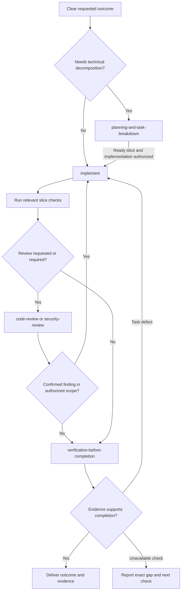

# Workflow

Start from the question or outcome you have. Most skills can be selected by the agent from the request. The Agile commands remain explicitly invoked by the user.

| Your request | Entry point | Result |
| --- | --- | --- |
| Build a clear, bounded change | [implement](engineering/implement.md) | A coherent change with fresh verification |
| Find why something is failing | [diagnosing-bugs](engineering/diagnosing-bugs.md) | Cause, evidence, and remaining uncertainty |
| Plan dependent work across sessions | [planning-and-task-breakdown](engineering/planning-and-task-breakdown.md) | Verifiable slices, dependencies, and ready frontier |
| Research an API, approach, or current practice | [research](engineering/research.md) | Cited findings and evidence limits |
| Stress-test a consequential decision | [grilling](productivity/grilling.md) | Confirmed understanding and owned unknowns |
| Try an uncertain design or feasibility idea | [prototype](engineering/prototype.md) | A reproducible experiment and observation |
| Design a module or responsibility boundary | [codebase-design](engineering/codebase-design.md) | An explicit interface and ownership decision |
| Simplify working code | [simplify](engineering/simplify.md) | Lower complexity with behavior-preservation evidence |
| Review changes | [code-review](engineering/code-review.md) | Evidence-backed findings at the requested depth |
| Run a dedicated security audit | [security-review](engineering/security-review.md) | Scoped threat model, findings, and closing checks |
| Pause, resume, or move work | [handoff](productivity/handoff.md) | Current state and the next executable check |
| Navigate backlog or delivery-cycle work | [agile-flow](agile/agile-flow.md) | The next explicit Agile command or authorized delivery handoff |

## Delivery path

`implement` selects `tdd` for useful behavioral checks and `codebase-design` for material module decisions. Uncertain external facts go to `research`; a needed experiment goes to `prototype`. Their results return to the current task. A review or planning request alone finishes with its requested artifact. A request to plan and build proceeds through both within the existing authorization.

For a requested cleanup, `implement` selects `simplify` and receives its contract checks and result. `simplify` can also run standalone. It is not an automatic phase after every feature, and a cleanup that needs an architecture decision reaches `codebase-design` only for that decision.

## Agile and task continuity

Use `/agile-flow` for backlog readiness, cycle planning, product acceptance, and retrospective learning. Technical planning describes how to execute an outcome; sprint planning decides the goal and capacity of a delivery cycle. Working code and passing checks do not substitute for stakeholder acceptance.

Keep the project's existing issue, plan, or cycle record authoritative. Use `handoff` at an actual pause or transfer boundary, with evidence pointers and the ready frontier. Routine progress and final summaries stay with the workflow doing the work.

Commits, PRs, releases, and deployments follow the user's authorization and the project's tools. They are separate from proving the local result.

## Authoring and design basis

Use [writing-for-agents](authoring/writing-for-agents.md) for skills and agent instructions, [writing-for-humans](authoring/writing-for-humans.md) for prose, and [html-writeup](authoring/html-writeup.md) for a visual HTML document.

The [preferred-source research](research/preferred-skill-repositories-workflow-gap-research.md) records the six inspected repositories, revisions, influences, and decisions behind these additions.
