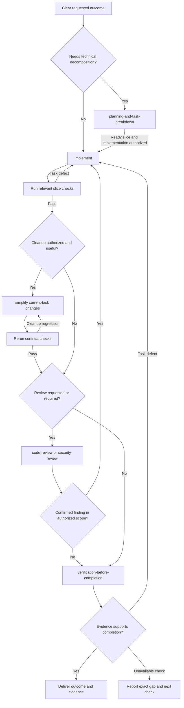

# Workflow

Start from the question or outcome you have. Most skills can be selected by the agent from the request. The ADLC commands remain explicitly invoked by the user.

| Your request | Entry point | Result |
| --- | --- | --- |
| Build a clear, bounded change | [implement](engineering/implement.md) | A coherent change with fresh verification |
| Route independent work among native agents and models | [orchestrate](engineering/orchestrate.md) | Bounded assignments, reconciled ownership, and verified integration |
| Find why something is failing | [diagnosing-bugs](engineering/diagnosing-bugs.md) | Cause, evidence, and remaining uncertainty |
| Plan dependent work across sessions | [planning-and-task-breakdown](engineering/planning-and-task-breakdown.md) | Verifiable slices, dependencies, and ready frontier |
| Research an API, approach, or current practice | [research](engineering/research.md) | Cited findings and evidence limits |
| Stress-test a consequential decision | [grilling](productivity/grilling.md) | Confirmed understanding and owned unknowns |
| Try an uncertain design or feasibility idea | [prototype](engineering/prototype.md) | A reproducible experiment and observation |
| Design a module or responsibility boundary | [codebase-design](engineering/codebase-design.md) | An explicit interface and ownership decision |
| Simplify working code | [simplify](engineering/simplify.md) | Lower complexity with behavior-preservation evidence |
| Review changes | [code-review](engineering/code-review.md) | Evidence-backed findings at the requested depth |
| Ship finished changes | [ship-it](engineering/ship-it.md) | A verified PR, merge, or deployment endpoint |
| Apply or define coding conventions | [coding-standards](engineering/coding-standards.md) | Project-first rules for the affected code domain |
| Run a dedicated security audit | [security-review](engineering/security-review.md) | Scoped threat model, findings, and closing checks |
| Pause, resume, or move work | [handoff](productivity/handoff.md) | Current state and the next executable check |
| Take work from intent to an approved plan with human gates | [adlc-flow](adlc/adlc-flow.md) | The next explicit ADLC command or authorized delivery handoff |

## Delivery path

```mermaid
flowchart TD
    A[Clear requested outcome] --> B{Needs technical decomposition?}
    B -->|Yes| P[planning-and-task-breakdown]
    B -->|No| I[implement]
    P -->|Ready slice and implementation authorized| I
    I --> C[Run relevant slice checks]
    C -->|Pass| S{Cleanup authorized and useful?}
    C -->|Task defect| I
    S -->|Yes| SC[simplify current-task changes]
    SC --> VC[Rerun contract checks]
    VC -->|Pass| R{Review requested or required?}
    VC -->|Cleanup regression| SC
    S -->|No| R
    R -->|Yes| CR[code-review or security-review]
    CR --> F{Confirmed finding in authorized scope?}
    F -->|Yes| I
    F -->|No| V[verification-before-completion]
    R -->|No| V
    V --> E{Evidence supports completion?}
    E -->|Yes| O[Deliver outcome and evidence]
    E -->|Task defect| I
    E -->|Unavailable check| G[Report exact gap and next check]
```

`implement` selects `tdd` for useful behavioral checks and `codebase-design` for material module decisions. Uncertain external facts go to `research`; a needed experiment goes to `prototype`. Their results return to the current task. A review or planning request alone finishes with its requested artifact. A request to plan and build proceeds through both within the existing authorization.

When native delegation is useful, `orchestrate` selects agents and models for ready slices while the root retains integration ownership. It composes the workflow doing the work: `implement` still owns implementation discipline and `verification-before-completion` owns completion evidence. Claude Code uses Claude-native agents; Codex uses Codex-native agents. Small localized work stays with its current owner.

During planning and design, consider whether an existing owner or suitable native facility already solves the problem. This applies Ponytail's reuse-first guidance before new complexity is introduced.

When cleanup is requested or included in the authorized workflow, `implement` selects `simplify` after the relevant slice checks pass and before review and final verification. Keep the pass scoped to current-task changes, preserve observable behavior, and rerun the contract checks afterward. Resolve or undo cleanup regressions before review; report unavailable checks as evidence gaps. Skip the pass when no useful simplification is evident.

`implement` retains delivery coordination, `simplify` owns cleanup, and `codebase-design` owns consequential architecture decisions. Ponytail's guidance is incorporated into `simplify`, rather than adding a separate workflow stage. `simplify` can also run standalone; it is not an automatic phase after every feature.

## Task continuity

Keep the project's existing issue, plan, or cycle record authoritative. Use `handoff` at an actual pause or transfer boundary, with evidence pointers and the ready frontier. Routine progress and final summaries stay with the workflow doing the work.

Commits, PRs, releases, and deployments follow the user's authorization and the project's tools. They are separate from proving the local result.

For finished work, `ship-it` coordinates delivery using `code-review`,
`verification-before-completion`, `git-workflow`, and `babysit-pr`. Bare "ship it"
targets a merge-ready PR; an explicit publication, merge or deployment request
sets that endpoint instead. Local implementation remains owned by `implement`,
Git transitions by `git-workflow`, and the remote repair loop by `babysit-pr`.

## Agentic development lifecycle

Use `/adlc-flow` when work should pass named human gates before agents build. `/adlc-intent`, `/adlc-spec`, and `/adlc-plan` each commit one artifact that the next stage reads, and `/adlc-gate` records the human's decision against the artifact's content hash. An approved plan hands off to `implement` or `orchestrate`, and the delivery path above runs unchanged.

## Authoring and design basis

Use [writing-for-agents](authoring/writing-for-agents.md) for skills and agent instructions, [writing-for-humans](authoring/writing-for-humans.md) for prose, and [html-writeup](authoring/html-writeup.md) for a visual HTML document.

The [preferred-source research](research/preferred-skill-repositories-workflow-gap-research.md) records the six inspected repositories, revisions, influences, and decisions behind these additions.
