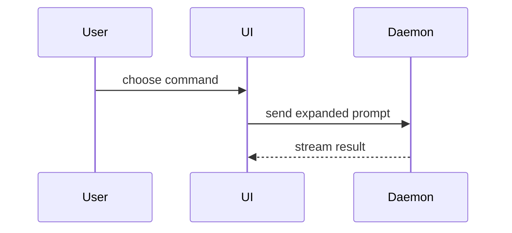

# Summary visuals

Read when a PR summary needs a visual. Pick the smallest view that makes the key
point clear. One is usual, several are occasionally right, and all of them is
never right. Keep only the calls, files, props, states, and boundaries a reviewer
needs; place each visual beside the sentence it supports.

| The change is about | Show |
| --- | --- |
| Logic or an algorithm | Pseudocode |
| Runtime control flow | A call tree |
| UI structure, including state and module boundaries that matter | A component tree |
| File responsibility or a broad refactor | A shallow file tree with one-line roles |
| Interaction or data flow between components | A Mermaid sequence or flow diagram |
| What changes inside a shape that already exists | A `diff` sketch of that shape |
| Mostly new code, or a target shape the reviewer will copy | The whole block |

## Shapes

Pseudocode:

```text
on(save)
  if content is unchanged
    return cached result
  write new content
  return fresh result
```

Call tree:

```text
submitForm
  createSession
    persistPrompt
    launchAgent
  navigateToSession
```

Component tree, with the paths that locate ownership:

```text
<SessionPage> (apps/web/src/routes/session.tsx)
  useSessionEvents()
  <SessionToolbar>
    <RunSkillButton> (packages/ui)
```

File tree:

```text
src/
├── commands/       # parses user actions
├── sessions/       # owns session state
└── transport/      # sends API requests
```

Mermaid:



## Diff sketches

Use `diff` when the point is what changes and the surrounding shape already
exists. Match the sketch to the topic: a component tree for a UI change, a file
tree for a layout change, a call tree for a call-path change, pseudocode for a
state or control-flow change.

```diff
 submitForm
   createSession
     persistPrompt
+    expandSkillMention
     launchAgent
-  navigateToSession
+  navigateToSession
+    subscribeToEvents
```

```diff
 src/
 ├── commands/
+│   └── expand.ts        # expands the slash command
 ├── sessions/
-└── transport.ts
+└── transport/
+    ├── client.ts
+    └── stream.ts
```

Show the whole block instead when omitted context would hide ownership or order.

---

Adapted from Matt Pocock's [`pr`](https://github.com/mattpocock/skills/blob/main/skills/engineering/pr/SKILL.md)
skill, whose visual menu comes from Dex Horthy's
[`show-me`](https://github.com/humanlayer/skills/blob/main/plugins/show-me/skills/show-me/SKILL.md)
skill (both MIT).
